# Sprint 1

Team: 1

## Inledning

Start: 20 april
Slut: 26 april

I sprint 1 testar vi följande roller:

- Project Owner: Birk
- Scrum Master: Jonas
- Developers: Alla

Backlog vid sprintstart

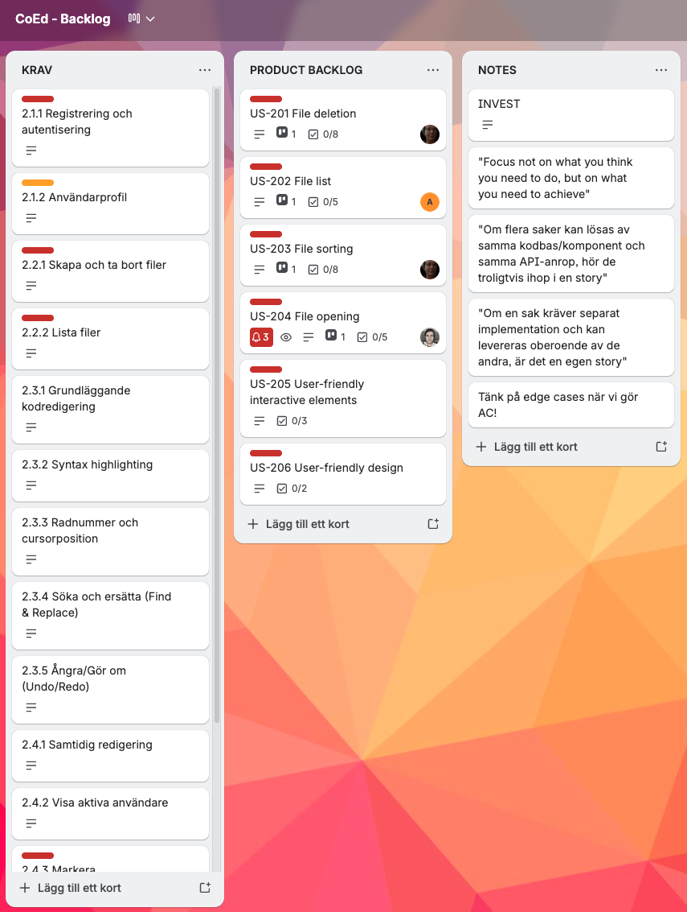

- Vi använder Trello som planeringsverktyg.
- Vi utgår från tavlan backlog.
- Vi skriver user stories med tillhörande acceptance criterias, utifrån kraven.
- Vi väljer vilka user stories som ska ingå i aktuell sprint och flyttar över dem till sprintens tavla (I bilden ovan är alla user stories kopplade till sprint1 redan flyttade till tavlan för sprint 1)
- Vi skriver tasks utifrån user stories
- Vi skriver spikes, backlogs och bugfixes utefter behov.
- Vi flyttar uppgifterna till doing, needs review, done allteftersom arbetet fortskrider.

## Sprint planning

Översikt över sprint 1

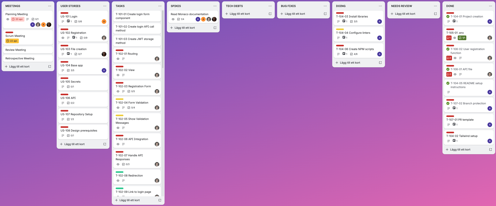

### Sprintmål

- Fungerande app
- Krav 2.1.1

Vi har valt dessa krav för att det känns som en lagom start i sprint 1. Vi halkade efter i starten och därför tycker vi att en kort sprint1 är ett bra val. Vi kan få appen levande och få igång strukturen för vårt arbete.

### User Stories
(I varje bild för user story framgår acceptance criterias i punktlistan)

---
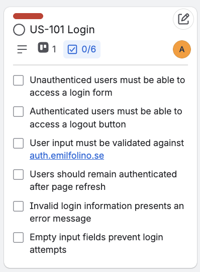
Ansvarig: Attila

---
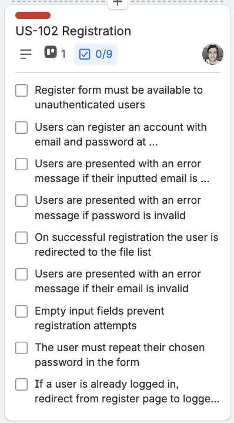
Ansvarig: Jonas

---
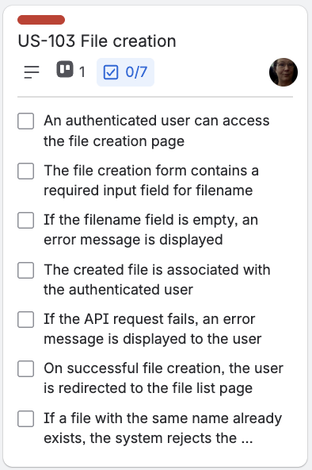
Ansvarig: Zara

---
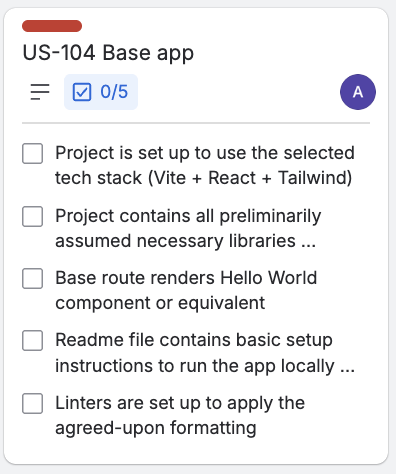
Ansvarig: Birk

---
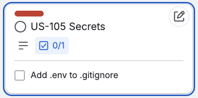
Ansvarig: Jonas

---
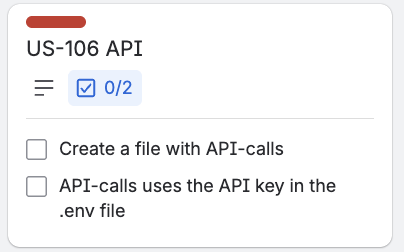
Ansvarig: Jonas

---
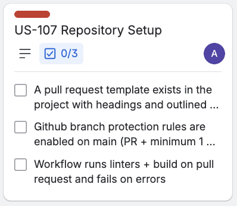
Ansvarig: Birk

---
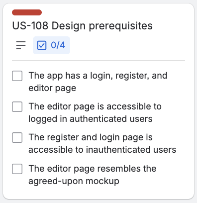
Ansvarig: Birk

---

### Spikes

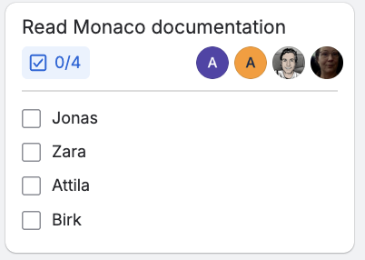

Vi såg behovet av att se närmre på dokumentationen kring Monaco för att vara förberedda i kommande sprintar.

## Tasks

Eftersom vi använder gratisversionen av Trello saknas möjlighet att få fram alla tasks med tillhörande detaljer i listform. Här följer därför bilder på samtliga tasks. Att klippa ut alla detaljer för varje task och klistra in i detta dokument vore otroligt tidskrävande. Om lärare önskar mer detaljer föreslår jag inbjudan till vår Trello.

| | | | |
|---|---|---|---|
| 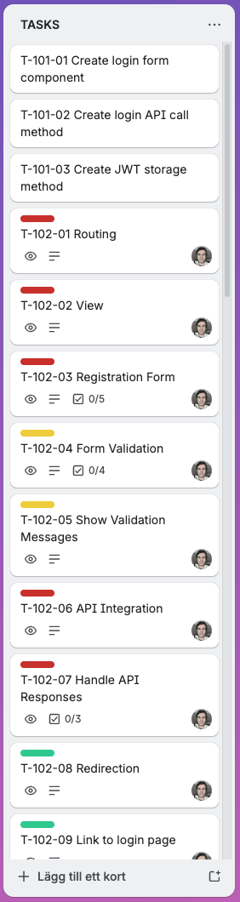 | 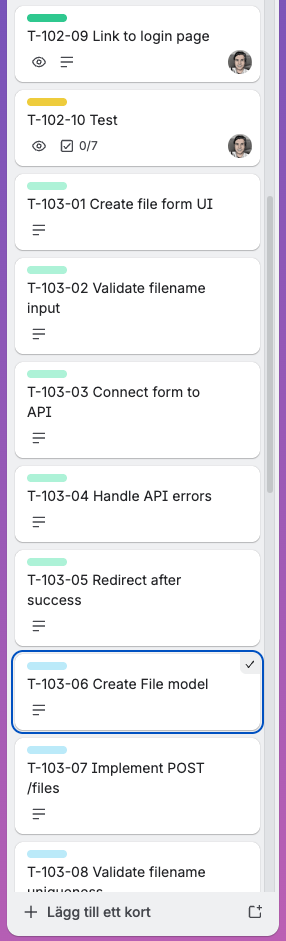 | 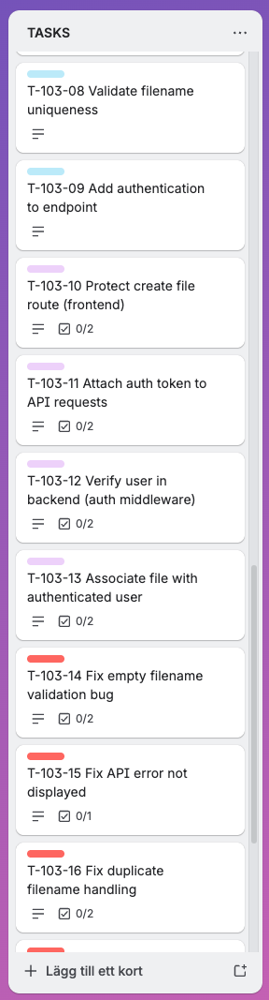 | 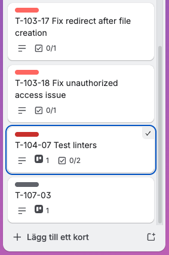 |

## Leveransdokumentation

### Färdigställda user stories

Sprinten levererades exakt enligt plan. Hänvisar därför till detaljer ovan i sprint planning.

### Tasks

Tasks från planeringen färdigställdes. En del tasks tillkom under arbetets gång, mest gällande applikationens setup. Här följer samtliga färdigställda tasks:

| | | | |
|---|---|---|---|
| 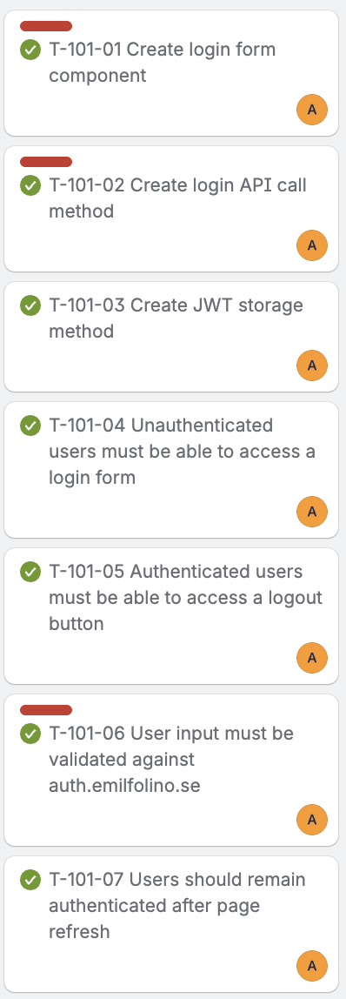 | 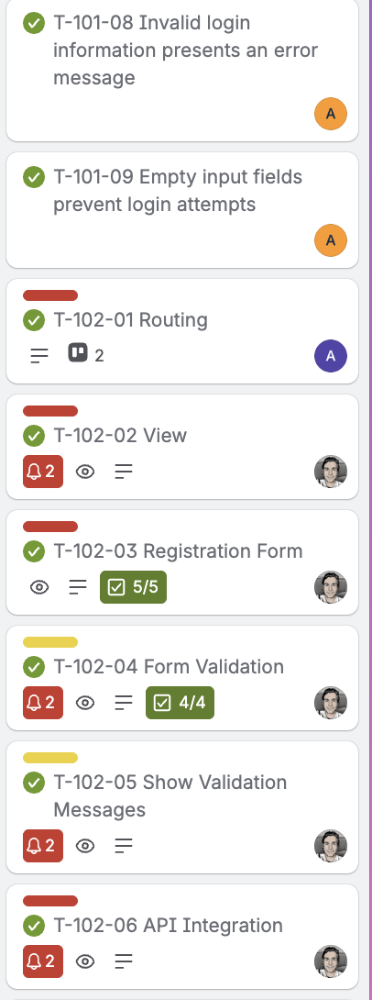 | 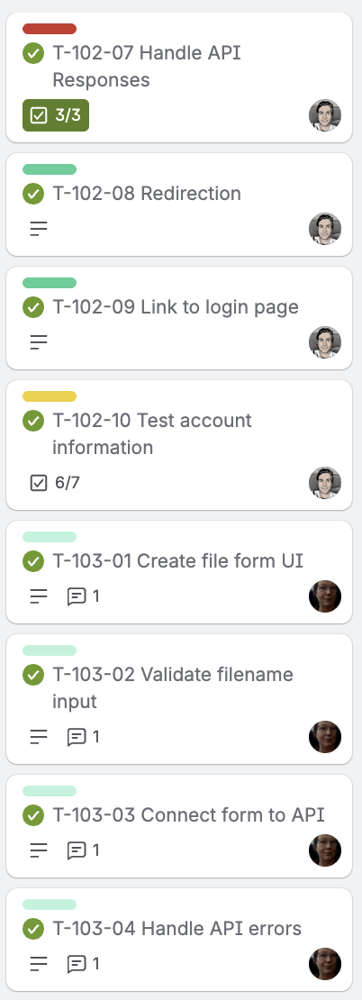 | 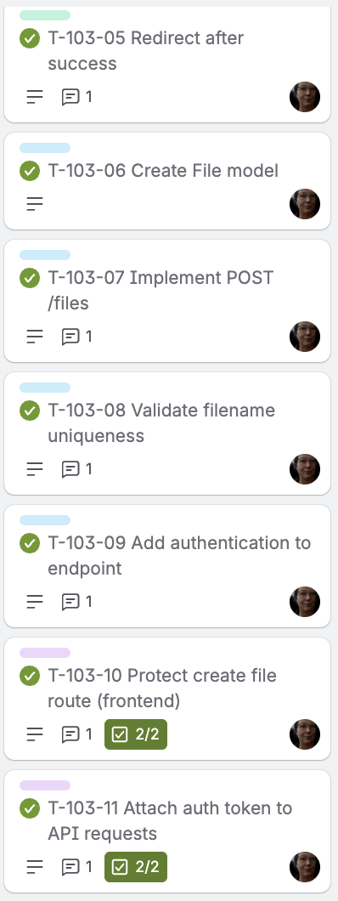 |
| 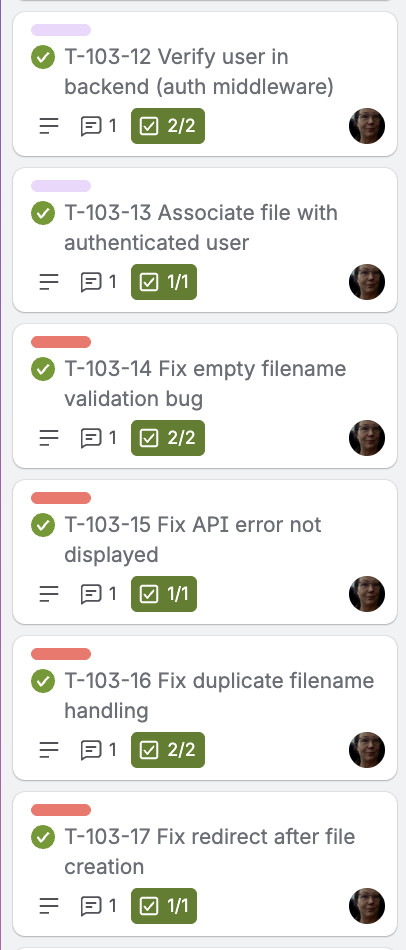 | 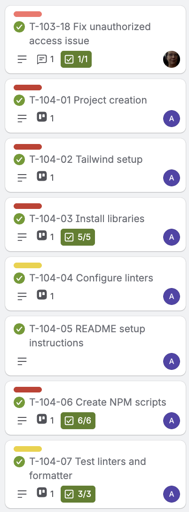 | 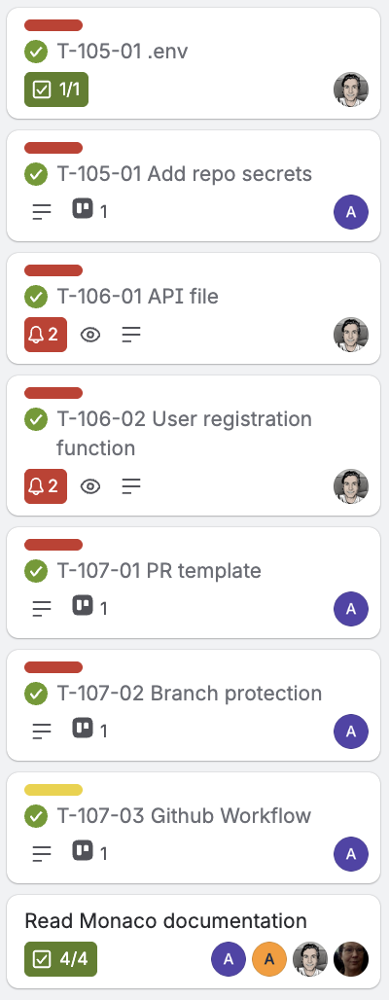 | |

### Fördelning

Vi har i stort fördelat arbetet utifrån user stories, dvs att en gruppmedlem har tilldelats samtliga tasks kopplat till samma user story. Exakt vem som ansvarade för vad framgår ovan i sprint planning. Planen följdes.

### Backlog

Efter denna sprint ser backlog ut så här:

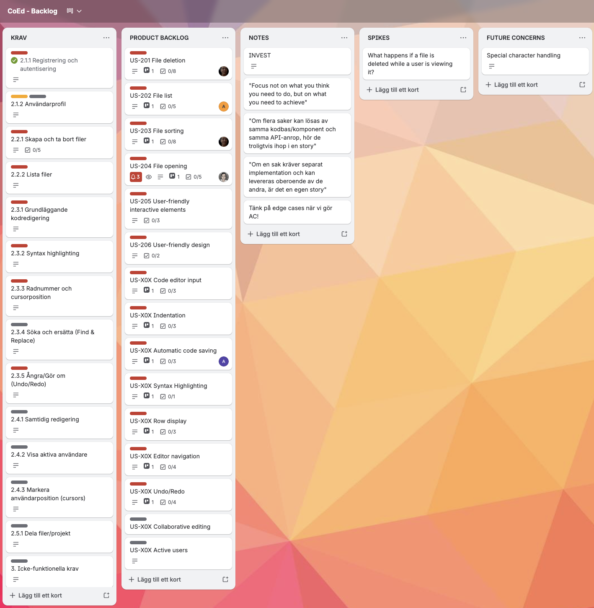

### Tidsutfall – hur många timmar användes per task?

Utgår i sprint 1

### Definition of Done

- Task-nivå:
Koden är skriven och fungerar lokalt
Felhantering är implementerad där det är relevant
En annan gruppmedlem har genomfört code review via PR
Koden är mergad till main
- User story-nivå tillkommer:
Samtliga tillhörande tasks är klara
Alla acceptanskriterier är uppfyllda
Ingen känd bugg kvarstår

## Sprint retrospective

### Vad fungerade bra? T ex vad ni är nöjda med — tekniskt, processmässigt eller samarbetsmässigt?

- Birk tog eget initiativ för att få en grund i projektet med user stories för setup och design prerequisites. Ett arbete som blev större än gruppen förutsåg
- Bra kommunikation i gruppen som tex när vi hade första konflikt på PR. Vi känner i gruppen att våra kommunikationskanaler är bra då vi har Trello, Zoom och Whatsapp. Detta kanaler som passar gruppens medlemmar och vardag.
- Gruppen har "högt till tak" utan prestige, men alla är seriösa och driver arbetet framåt. Vi har en skämtsam ton och ödmjuka för att alla har annat i livet också. Alla har inställningen att det är viktigt att vi når mål, men bortser hur det ser ut på vägen. Vi respekterar varandras omdöme och kunskap.

### Vad fungerade mindre bra?

Det är tydligt att vi i gruppen är ojämna i antal commits under arbetet och vi bestämmer att vi alla ska anstränga oss att göra fler commits under arbetet, minst för varje task.

Workflow (GitHub actions) tog oplanerat mycket tid för Birk i Sprinten vilket gjorde att Birk upplevde att han fick lägga mindre tid på de tasks han blivit tilldelad. Men gruppen är tacksam för att han fixade uppgiften.

### Vad skapade friktion, förseningar eller frustration? Var ärliga — retrospektivet är ett verktyg för förbättring, inte en värdering av gruppen.

Vi anser inte att det varit friktion eller frustration. När det gäller förseningar så kämpar vi fortfarande med att vi kom igång sent i projektet på grund av utmaningar i gruppkonstellation. Andra förseningar var merjobb för Birk som inte planerats in. Vi har också insett att vi kan hamna i förseningar då det inte finns en planering över våra olika arbetsinsatser. Våra US och tasks är beroende av varandra och arbetet kan behöva ske i en planerad process, dvs hur vi "jackar in" i varandras lösningar och arbete.

### Vad gör vi annorlunda nästa sprint?

Vi behöver synka arbetstiden bättre med tidsaspekt för våra tasks och när vi har våra olika "arbetstider". Detta tänker vi löser sig i Sprint 2 i och med tidloggning och estimering som läggs till i projektet.

### Formulera minst en konkret åtgärd — inte bara en insikt. En åtgärd är något ni faktiskt kan följa upp: vad ska göras, av vem och när?

Birk fastställer färgschema för appen som vi använder från och med sprint 2. Fastställs vid uppstartsmötet för sprint 2. Zara kommer sedan att granska den och föreslå eventuella förändringar och förbättringar utifrån användarvänlighet. Slutlig version beslutas av gruppen.

## Estimering

Utgår i sprint 1
