# Sprint 2

Team: 1

## Inledning

Start: 27 april
Slut: 8 maj

I sprint 2 fortsätter vi med samma roller:

- Project Owner: Birk
- Scrum Master: Jonas
- Developers: Alla

I alla screenshots visas vem som ansvarar för vad via de små runda ikonerna enligt följande:

- Stilren gul cirkel med ett stort A: Attila
- Vackert foto: Zara
- Tecknat foto på en gubbe i sina bästa år: Jonas
- Tecknad snubbe med coola brillor: Birk

Backlog vid sprintstart

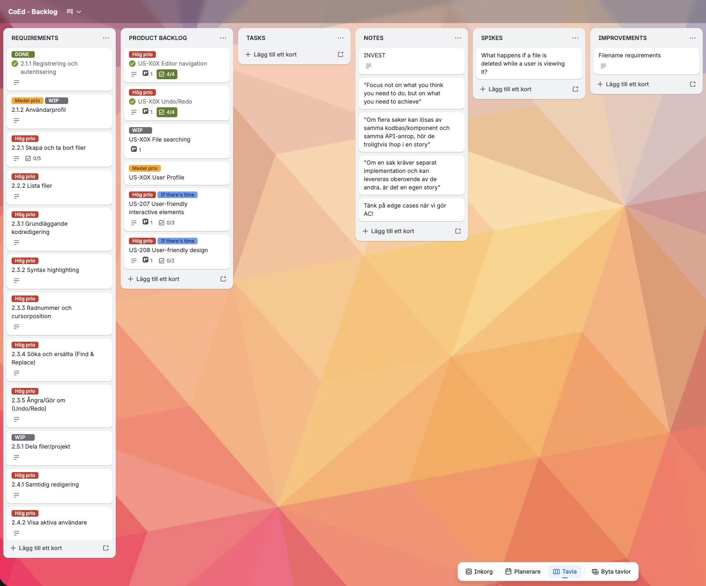

- Vi använder Trello som planeringsverktyg.
- Vi utgår från tavlan backlog.
- Vi skriver user stories med tillhörande acceptance criterias, utifrån kraven.
- Vi väljer vilka user stories som ska ingå i aktuell sprint och flyttar över dem till sprintens tavla (I bilden ovan är alla user stories kopplade till sprint 2 redan flyttade till tavlan för sprint 2)
- Vi skriver tasks utifrån user stories
- Vi skriver spikes, backlogs, bugfixes och improvements utefter behov.
- Vi flyttar uppgifterna till doing, needs review, done allteftersom arbetet fortskrider.

## Sprint planning

### Sprintmål

I denna sprint siktar vi på att få all funktionalitet kring projekt, filer och användare på plats. Hittills har vi fokuserat mindre på utseende och design, men nu vill vi att appen även ska få ett fint utseende.

### User Stories

I sprinten ingår elva user stories. Dessa inklusive acceptance criterias framgår av bilderna här under. Vid sprintens start arbetade vi fram user stories från 201 till 209. Övriga user stories tillkom under sprintens gång, då vi såg att vi hade kapacitet till mer än vi först trodde.

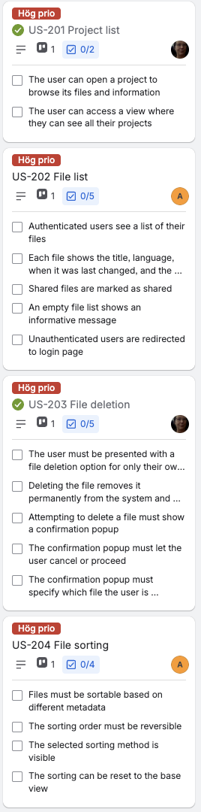
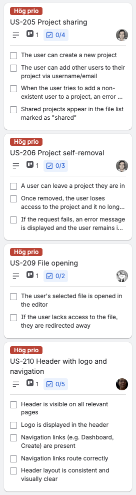
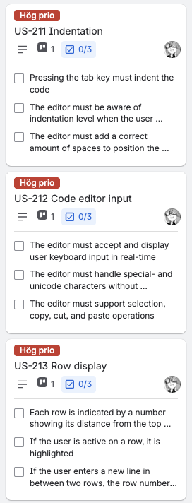

## Tasks

I sprinten ingår 42 tasks. Dessa framgår av bilderna här under.

#### Tasks tillhörande user story 201

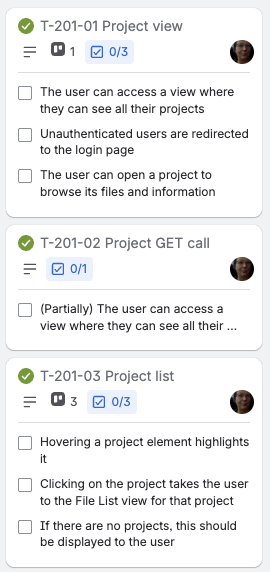

#### Tasks tillhörande user story 202

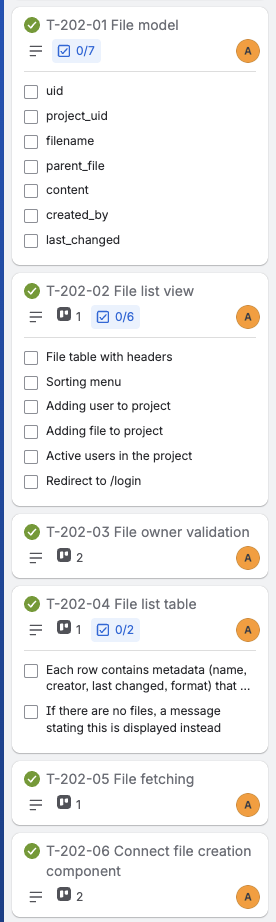

#### Tasks tillhörande user story 203

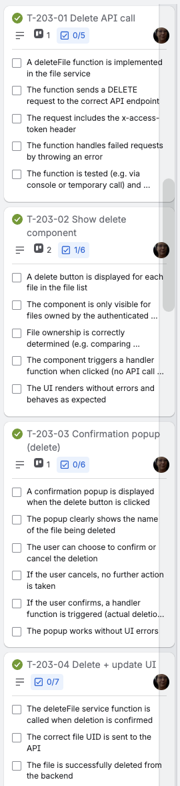

#### Tasks tillhörande user story 204

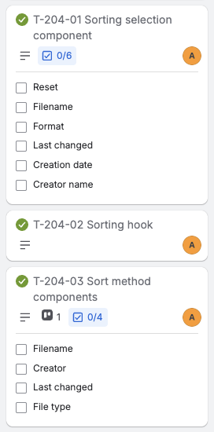

#### Tasks tillhörande user story 205

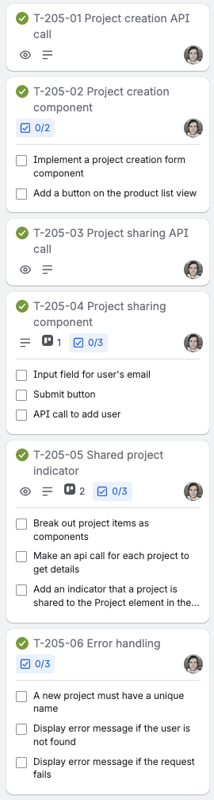

#### Tasks tillhörande user story 206

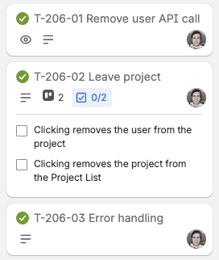

#### Tasks tillhörande user story 209

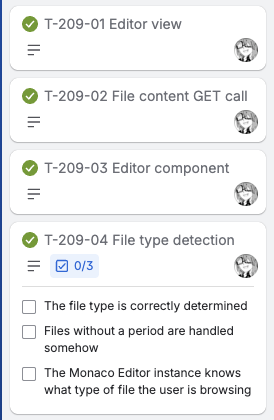

#### Tasks tillhörande user story 210

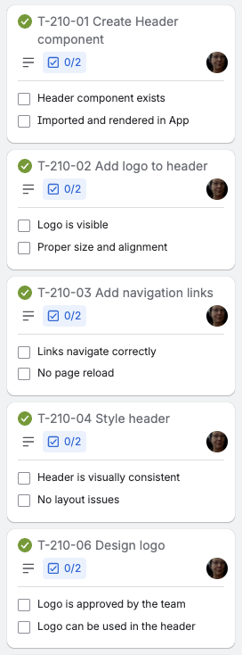

#### Tasks tillhörande user story 211

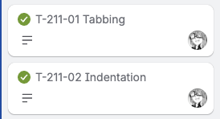

#### Tasks tillhörande user story 212

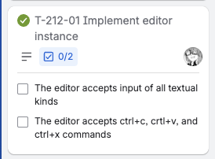

#### Tasks tillhörande övriga user stories

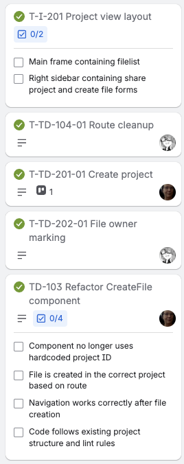

## Leveransdokumentation

### Färdigställda user stories och tasks

Sprinten levererades med samtliga user stories och tasks enligt ovan.

### Fördelning

Vi fortsatte, precis som i sprint 1, att fördela arbetet i paket utifrån user stories. En samling med tasks kopplat till en och samma user story hänger ofta ihop och det känns naturligt att samma person jobbar med dem.

Se förklaringen i inledningen för att förstå fördelningen på alla screen shots.

Se även tidsdokument för att se fördelning.

### Backlog

Efter denna sprint ser backlog ut så här:

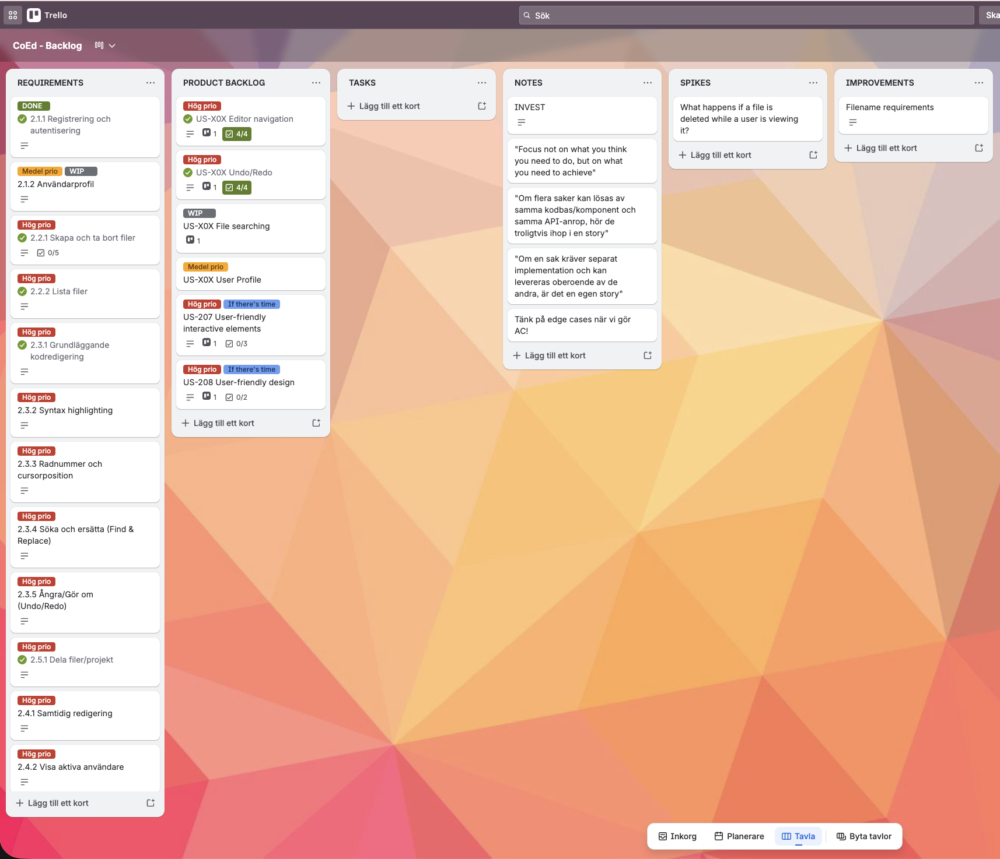

### Tidsutfall – hur många timmar användes per task?

Planering, estimering och uppföljning gjordes i google-dokument, som blev skickat till oss. Dokumentet är fullständigt och både estimering och utfall framgår:

[Tidsdokument](https://docs.google.com/spreadsheets/d/1Cj82wGMDa-i7hF9wUEqv0lTfZRJZFq_n0UjPzBwrk6s/edit?gid=1#gid=1)

### Definition of Done

- Task-nivå:
Koden är skriven och fungerar lokalt
Felhantering är implementerad där det är relevant
En annan gruppmedlem har genomfört code review via PR
Koden är mergad till main
- User story-nivå tillkommer:
Samtliga tillhörande tasks är klara
Alla acceptanskriterier är uppfyllda
Ingen känd bugg kvarstår

## Sprint retrospective

### Vad fungerade bra? T ex vad ni är nöjda med — tekniskt, processmässigt eller samarbetsmässigt?

Vi är så enigt nöjda med vår grupp, samarbetet, processen och resultatet så långt. Det känns som vi har hittat bra roller och fördelning i gruppen. Birk gör ett ovärderligt arbete som project owner. Framförallt tar han stort ansvar i arbetet med user stories och tasks och han är även den som har ett helikopterperspektiv över hela skogen när vi andra jobbar med våra träd. Vi är fortsatt nöjda med de kanaler och den kommunikation vi har. Passar oss alla med våra individuella liv. Alla tar fullt ansvar och fullföljer sitt arbete enligt överenskommelse.

### Vad fungerade mindre bra?

Vi kämpar fortfarande med att vi ligger något efter i inlämningarna men samtidigt tar vi det med en lugn plan om att vi kommer att ta igen det.

### Vad skapade friktion, förseningar eller frustration? Var ärliga — retrospektivet är ett verktyg för förbättring, inte en värdering av gruppen

Det enda som egentligen skapat försening i vår plan var att Jonas fick planera om och invänta lösningen kring API:et för att kunna utveckla lösningen för att ta bort från projekt.

### Vad gör vi annorlunda nästa sprint?

Vi har identifierat att vi kommer att behöva en ökad diskussion och koordination kring vår kod. Vi kommer gå in mer i findetaljer i projektet där små ändringar kan få stora konsekvenser och det måste vi hantera varsamt genom tydligt plan och kommunikation.

### Formulera minst en konkret åtgärd — inte bara en insikt. En åtgärd är något ni faktiskt kan följa upp: vad ska göras, av vem och när?

Vi ser att vi behöver städa upp i App.jsx och se till att routes är korrekta. Detta blir en uppgift för vår project owner Birk.

## Estimering

[Tidsdokument](https://docs.google.com/spreadsheets/d/1Cj82wGMDa-i7hF9wUEqv0lTfZRJZFq_n0UjPzBwrk6s/edit?gid=1#gid=1)

I planning-mötet för sprint 2 diskuterade vi länge kring vilket upplägg vi skulle använda för tidsestimering och tidsplanering. Vi pratade om planning poker och gick igenom reglerna, men när det var dags att köra igång gick det upp ett ljus för oss vad skillnaden mellan att planera i timmar och i poäng. Planerar man i poäng gäller lika många poäng för en task oavsett vem som ska utföra den, men planerar man i timmar blir tidsestimeringen väldigt individuell. Vi kan alla enas om att en task bör vara exempelvis 3 poäng, men det blir märkligt om jag ska styra att Birk ska utföra den på 2 timmar.

Vår lösning landade i att när vi hade tagit fram user stories och tasks kunde gruppmedlemmarna plocka på sig uppgifter som på en buffé och i samband med det estimera tidsåtgång för eget arbete. Det blev en dynamisk process som varade i några dagar och under dessa dagar kunde även det riktiga arbetet påbörjas direkt.

Efter hand som tasksen tog slut och vi såg att det fanns utrymme för mer i sprinten tog vi fram nya tasks och de gruppmedlemmar som behövde mer jobb kunde förse sig.

Vi markerade även tasksen i tidsdokumentet med grön färg på de dagar då vi planerade att jobba med dem. Då kunde man se vilka funktioner som beräknades finnas på plats på tidslinjen. Detta var något vi saknade i sprint 1.

Vi är en grupp med medlemmar som har många järn i elden och varierande dagsrutiner, så det kan vara klurigt att hitta tidpunkter för möten mm. Detta ställer extra stora krav på vi alla tar ansvar för att allt ska gå ihop. Den metod vi valde fungerade väldigt bra för oss och så som vi har förstått konceptet Scrum handlar det om att tweaka metoderna för att få optimalt ut ur gruppen.
